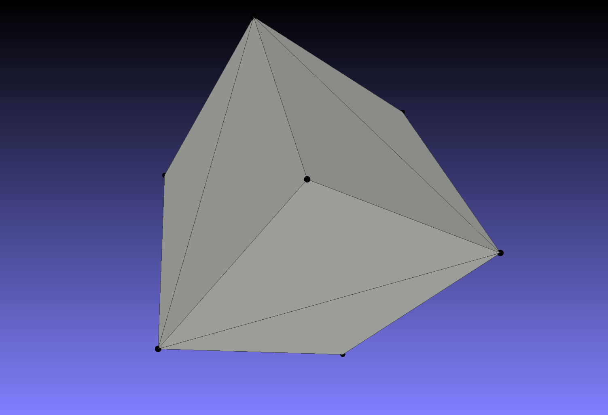

* example (test_mesh.cpp)
```cpp
#include <iostream>
#include <string>
#include "mesh.hpp"

int main(int argc, char* argv[])
{
    using namespace cnthd;

    if (argc == 1)
    {
        std::cout << "./a.out input.obj output.obj" << std::endl;
        return 0;
    }

    std::string infile{argv[1]};
    std::string outfile{argv[2]};

    Mesh mesh = read_obj(infile);
    std::cout << mesh << std::endl;
    write_obj(mesh, outfile);

    return 0;
}
```

## cube_small.obj


```txt
v 0 0 0
v 0 0 1
v 0 1 0
v 0 1 1
v 1 0 0
v 1 0 1
v 1 1 0
v 1 1 1
f 1 5 2
f 2 5 6
f 2 6 8
f 2 8 4
f 5 7 8
f 5 8 6
f 1 3 5
f 5 3 7
f 1 2 3
f 2 4 3
f 3 4 8
f 3 8 7
```

* stdout
```
nV: 8, nE: 18, nF: 12, g = 1 - 0.5 * (nV - nE + nF) = 0
vertex:
  v1: {0.000000, 0.000000, 0.000000}
  v2: {0.000000, 0.000000, 1.000000}
  v3: {0.000000, 1.000000, 0.000000}
  v4: {0.000000, 1.000000, 1.000000}
  v5: {1.000000, 0.000000, 0.000000}
  v6: {1.000000, 0.000000, 1.000000}
  v7: {1.000000, 1.000000, 0.000000}
  v8: {1.000000, 1.000000, 1.000000}
edge:
  e1: 1-5
  e2: 5-2
  e3: 2-1
  e4: 5-6
  e5: 6-2
  e6: 6-8
  e7: 8-2
  e8: 8-4
  e9: 4-2
  e10: 5-7
  e11: 7-8
  e12: 8-5
  e13: 1-3
  e14: 3-5
  e15: 3-7
  e16: 2-3
  e17: 4-3
  e18: 8-3
halfedge:
  he1: 1->5
  he2: 5->2
  he3: 2->1
  he4: 2->5
  he5: 5->6
  he6: 6->2
  he7: 2->6
  he8: 6->8
  he9: 8->2
  he10: 2->8
  he11: 8->4
  he12: 4->2
  he13: 5->7
  he14: 7->8
  he15: 8->5
  he16: 5->8
  he17: 8->6
  he18: 6->5
  he19: 1->3
  he20: 3->5
  he21: 5->1
  he22: 5->3
  he23: 3->7
  he24: 7->5
  he25: 1->2
  he26: 2->3
  he27: 3->1
  he28: 2->4
  he29: 4->3
  he30: 3->2
  he31: 3->4
  he32: 4->8
  he33: 8->3
  he34: 3->8
  he35: 8->7
  he36: 7->3
face:
  f1: 1-5-2
  f2: 2-5-6
  f3: 2-6-8
  f4: 2-8-4
  f5: 5-7-8
  f6: 5-8-6
  f7: 1-3-5
  f8: 5-3-7
  f9: 1-2-3
  f10: 2-4-3
  f11: 3-4-8
  f12: 3-8-7
adjacent matrix:
0 1 1 0 1 0 0 0
1 0 1 1 1 1 0 1
1 1 0 1 1 0 1 1
0 1 1 0 0 0 0 1
1 1 1 0 0 1 1 1
0 1 0 0 1 0 0 1
0 0 1 0 1 0 0 1
0 1 1 1 1 1 1 0
adjacent list:
{{4, 1, 2}, {4, 0, 5, 7, 3, 2}, {0, 4, 6, 1, 3, 7}, {7, 1, 2}, {0, 1, 5, 6, 7, 2}, {4, 1, 7}, {4, 7, 2}, {5, 1, 3, 6, 4, 2}}
```

## null.obj
```
nV: 0, nE: 0, nF: 0, g = 1 - 0.5 * (nV - nE + nF) = 1
vertex:
edge:
halfedge:
face:
adjacent matrix:

adjacent list:
{}
```
